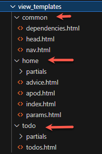

# Lab 5: ToDo List CRUD


## Introduction

This lab build on the previous one where you created a To Do list with an add item function. Next you will complete the **CRUD** (create, read, update, delete) functions.


### Getting started

**Start by cloning this repository and opening in VS Code.**

1. Configure the Python Virtual Environment

   `python -m venv venv --prompt="lab5"`

2. Activate the Virtual Environment

   `venv\Scripts\activate`

3. Install dependencies

   `pip install fastapi uvicorn jinja2 python-multipart httpx`

4. Setup the `.env` file, e.g. based on `.env.example`

5. Run the application

   `uvicorn app.main:app --reload --port=5000`


### Changes to view_templates structure

The starter application structure has been updated a little to better organise the view templates. These changes also require paths used in code to be updated.



The todo partials have also been updated to avoid replication - compare with the previous versions.


## 1. Updating a todo item

This feature will allow an existing item to be updated, for example changing the details or the completed status. Once complete, clicking the pencil icon button will load form in place of the list item:


Submitting the form, via the update button, will update the todo item and display it in the list.

#### 1.1. Swap the list item for a form

Clicking the pencil edit button will start off this operation. Open **`view_templates/todo/partials/todo_li.html`**

The edit button is highlighted below. Note the **`htmx`** attributes:

1. **`hx-target="closest li"`** - This sets the element to be replaced with the form, in this case the closest `<li>` element.
2. **`hx-swap="outerHTML"`** - The target element will be completely replaced (`outerHTML`).
3. **`hx-get="/todo/update/{{ todo.id }}"`** - The route which will handle this request. Note the id parameter.
4. **`hx-trigger="click"`** - What event will trigger this process.


**Exercise: Modify the edit button as above**


#### 1.2. Add a route to handle `GET` requests for `todo/update/`

This route will return the editing form which will replace the read-only list item.

Open **`app/routes/todo_routes.py`** and add the new route:


#### 1.3. Add a service function for `getTodo(id)`

This function should be added to **`app/services/todo_service.py`**. The function should then be imported in `todo_routes.py`

```python
# get the todo by id and return it
def getTodo(id : int) :
       todo : ToDo = dataGetTodo(id)
       return todo
```

#### 1.4. Add a data_access function for `dataGetTodo(id)`

This function should be added to **`app/data_access/todo_dba.py`**. The function should then be imported in `todo_services.py`

This function returns a todo from the list:

```python
# return todo from the list
def dataGetTodo(id : int) :
    return todos_list[id - 1]
```


#### 1.5. The update form

We can now build the form and fill it with the required todo for editing. Add a new file **`todo_update_form.html`** to **`view_templates/todo/partials/`**


The `form` element includes the `htmx` attributes which define what apps when the form is submitted:

1. **`hx-put="/todo/"`** - The route which will handle this request.
2. **`hx-target="closest li"`** - This sets the element to be replaced with the form, in this case the closest `<li>` element.
3. **`hx-swap="outerHTML"`** - The target element will be completely replaced (`outerHTML`).

Here is the code to save time, read the descriptions above so that you understand how it works.

```html
<li id="{{ todo.id - 1 }}" class="list-group-item d-flex justify-content-between align-items-start">
  <form class="ms-2 me-auto" hx-put="/todo/" hx-target="closest li" hx-swap="outerHTML">
      <div class="fw-bold">id: {{ todo.id }}</div>
      <input type="hidden" id="id" name="id" value="{{ todo.id }}">
      <div class="mb-1">
        <label for="details" class="form-label">Details</label>
        <input type="text" class="form-control" id="details" name="details" value="{{ todo.details }}">
      </div>
      <div class="form-check">
        <input class="form-check-input" type="checkbox" value="completed" id="completed" name="completed"
        checked>
        <label class="form-check-label" for="completed">Completed</label>
      </div>
      <button type="submit" class="btn btn-primary">Update</button>
      <button class="btn btn-primary">Cancel</button>
    </form>
</li>
```

#### 1.6. Handle the form after it is submitted

A new route to handle the HTTP **`PUT`** request is required. Open **`app/routes/todo_routes.py`** and add the new route:


```python
@router.put("/")
def update_item(request: Request, id: Annotated[int, Form()], details: Annotated[str, Form()], completed: Annotated[str, Form()] = ""):
    # get item value from the form POST data

    up_todo = updateTodo(id, details, completed)
    return templates.TemplateResponse("todo/partials/todo_li.html", {"request": request, "todo": up_todo})
```

#### 1.7. Add a service function for `updateTodo()`

This function should be added to **`app/services/todo_service.py`**. The function should then be imported in `todo_routes.py`

```python
def updateTodo(id: int, details : str, completed : str) :
     comp : bool = False
     # check completed state 
     if completed == 'completed' :
          comp = True

     item = ToDo(id=id, details=details, completed=comp)     
     updated = dataUpdateTodo(item)
     return updated
```

#### 1.8. Add a data_access function for `dataUpdateTodo(id)`

This function should be added to **`app/data_access/todo_dba.py`**. The function should then be imported in `todo_services.py`

This function returns a todo from the list:

```python
def dataUpdateTodo(todo) :
    print(todo.model_dump())
    todos_list[todo.id - 1] = todo
    return todo
```

#### 1.9. Test the update function

At this point the update function should be working. Test it and fix any errors.


## 2. Exercises

#### 1. Implement the delete button.

Clicking the button should result in a HTTP `DELETE` request. You will need to add route to handle the request and also service and data access functions.

#### 2. Change the colour of the completed state in the page depending on its value

#### 3. Add an option to show or hide completed items.

